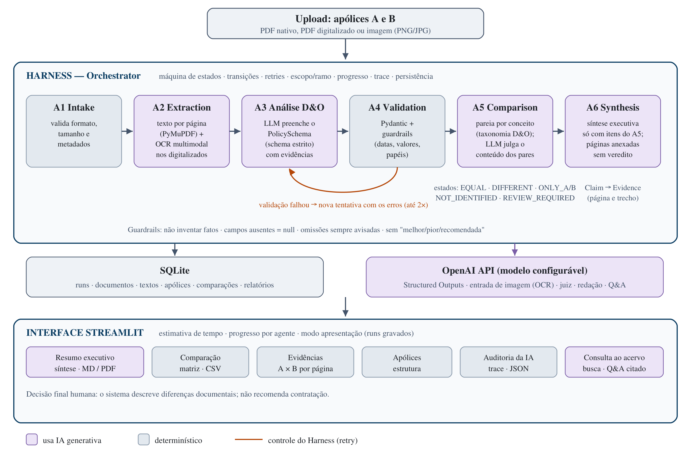

# InsurMinds_PROTETOR — Relatório Técnico

**Plataforma inteligente para análise e comparação de apólices D&O**  
Projeto Final · I2A2 — Instituto de Inteligência Artificial Aplicada · Outubro de 2026  
Grupo **Gp_Protetor** — Ricardo Croce (Chefe), José Carlos dos Passos, Renato Sant Anna, Tiago Del Rio e Juliano Silva Ignacio.  
Repositório: https://github.com/Georastreador/InsurMinds_Projeto_Final_PROTETOR

## 1. Resumo

O InsurMinds_PROTETOR é um MVP que recebe duas apólices ou condições contratuais de seguro D&O (Directors & Officers) em PDF ou imagem, extrai e estrutura seu conteúdo com IA generativa, compara coberturas, exclusões, franquias, limites e cláusulas, e apresenta ao analista uma síntese executiva em que cada diferença aponta a página de origem. O sistema não recomenda qual apólice contratar: descreve diferenças documentais e deixa a decisão ao especialista.

A solução é um **workflow orquestrado**: um **Harness** (orquestrador com máquina de estados) decide a sequência e controla seis etapas especializadas (A1 a A6) e uma etapa de consulta sob demanda. As etapas não decidem o fluxo; essa escolha privilegia previsibilidade e auditabilidade. Usa a API da OpenAI em seis pontos: OCR multimodal, extração estruturada, julgamento semântico da comparação, redação da síntese, respostas de consulta e classificador do guardrail anti-veredito.

No conjunto de avaliação principal (condições gerais D&O da Chubb e da Sompo, com anotação humana), três execuções LIVE reavaliadas em conjunto mostram: extração correta de todos os campos com valor anotado; evidência na página anotada em 100% dos casos e 98–100% dos trechos citados conferidos no texto da página; e acurácia de comparação de 0,77 em média (pior caso 0,70) no gabarito original v1.0, abaixo da meta de 0,90. No gabarito revisado v1.1, a média é 0,97. Uma análise completa de dois documentos de 50 a 70 páginas leva cerca de 3 minutos.

## 2. Problema e objetivos

Apólices de seguro são documentos longos e jurídicos. Em D&O, cada seguradora organiza coberturas, extensões, exclusões e cláusulas de forma própria, com nomes diferentes para conceitos equivalentes, e muitos valores (limites, franquias, vigência) ficam na Especificação da Apólice, não nas condições gerais. A comparação manual exige horas de leitura especializada.

Objetivos do MVP:

1. Receber documentos em PDF ou imagem e extrair o conteúdo automaticamente.
2. Estruturar a informação num formato comum e armazená-la.
3. Comparar ao menos duas apólices, identificando diferenças materiais.
4. Apresentar as principais diferenças com rastreabilidade Claim → Evidence (página e trecho).
5. Permitir consulta ao acervo de documentos processados.
6. Usar IA generativa de forma controlada: sem inventar fatos e sem emitir veredito.

## 3. Arquitetura da solução

A solução tem quatro camadas:

1. **Orquestração (Harness).** O `Orchestrator` mantém uma máquina de estados explícita (`CREATED → INGESTING → EXTRACTING → ANALYZING → VALIDATING → READY_TO_COMPARE → COMPARING → SYNTHESIZING → COMPLETED`, com `RETRYING`, `WARNING`, `REVIEW_REQUIRED` e `FAILED` como estados de exceção) e rejeita transições não previstas. O `CompleteMVPPipeline` executa os dois documentos sob um único `run_id` (A e B percorrem A1→A4 em paralelo; toda mudança de estado passa pelo `Orchestrator`), verifica cada trecho de evidência no texto da página, avalia o escopo (ramo e natureza do documento), emite o progresso para a interface, registra cada evento no trace e persiste os artefatos.
2. **Agentes especializados (A1 a A6 e Consulta).** Cada agente recebe uma entrada tipada e devolve uma saída tipada; nenhum decide a sequência, repete a si mesmo ou encerra a execução. Quatro deles usam IA generativa (A2 no OCR, A3, A5 e A6), sempre atrás de um contrato Pydantic e de guardrails no código.
3. **Infraestrutura.** A API da OpenAI é acessada por adaptadores que implementam contratos neutros de provedor (`StructuredLLMClient`, `SemanticComparator`, `SynthesisWriter`, `OCREngine`), o que permite testar tudo com implementações simuladas e trocar o modelo por configuração. O SQLite guarda runs, documentos, textos, apólices, comparações e relatórios, e alimenta a Consulta.
4. **Interface.** O Streamlit separa a experiência do analista (Resumo, Comparação, Evidências, Apólices, Consulta) da observabilidade técnica (Auditoria da IA), mostra estimativa de tempo e progresso por agente e reabre runs gravados no modo apresentação.

*Figura 1 — Arquitetura do InsurMinds_PROTETOR. Em lilás, os componentes que usam IA generativa; em cinza, os determinísticos. A seta tracejada laranja é o ciclo de nova tentativa controlado pelo Harness.*

| Contrato | Papel |
|---|---|
| `PolicySchema` | Representação canônica de um documento: identificação, vigência, limites, franquias, Sides A/B/C, coberturas, exclusões, cláusulas, extensões, ramo, natureza do documento e evidências |
| `ComparisonResult` | Um item por campo ou conceito comparado, com valores de A e B, evidência de cada lado, estado controlado, confiança e critério |
| `InsurMindsState` | Estado compartilhado do run: documentos, textos, apólices, comparação, síntese, métricas, avisos e trace |
| Taxonomia D&O | 18 conceitos de cobertura, 17 de exclusão e 23 de cláusula (estrutura SUSEP), usados para parear itens entre seguradoras |

**Princípio central:** o Harness controla o sistema; os agentes executam funções delimitadas. Isso torna o comportamento previsível, auditável e testável sem chamadas de API.

## 4. Fluxo completo de processamento

1. **Upload:** o analista envia A e B. A interface mostra páginas, tamanho, páginas digitalizadas e o tempo estimado.
2. **A1 Intake:** valida existência, tamanho e formato (PDF, PNG, JPG) e registra metadados.
3. **A2 Extraction:** extrai o texto nativo por página com PyMuPDF e insere marcadores `[[PÁGINA n]]`. Páginas com imagem e sem camada de texto, e arquivos de imagem, passam por OCR multimodal com GPT, em lotes de 4 páginas, com transcrição literal.
4. **A3 Análise:** o LLM recebe o texto (até 300 mil caracteres; acima disso mantêm-se as primeiras páginas e as de maior densidade contratual, com aviso) e preenche o `PolicySchema` via Structured Outputs com JSON Schema estrito. Classifica ramo, natureza do documento e o conceito D&O de cada item.
5. **A4 Validação:** valida o candidato com Pydantic, normaliza datas brasileiras, rejeita anos implausíveis, remove "valores" que são apenas definições de papel e impede que a retroatividade seja registrada como prazo complementar. Se falhar, o Harness pede ao A3 nova tentativa com a lista de erros (até 2 retries).
6. **Verificação de evidência:** cada trecho citado pelo A3 é procurado no texto da página citada; trechos em outra página ou não localizados são sinalizados e reduzem a confiança do item na comparação.
7. **Escopo:** o Harness confirma o ramo (LLM com reforço determinístico) e marca o run como "D&O validado" ou "genérico".
8. **A5 Comparação:** compara campos simples, limites e Sides A/B/C; pareia coberturas, exclusões e cláusulas pelo conceito da taxonomia; pede ao LLM o pareamento de itens órfãos (sempre enviados à revisão humana) e o julgamento do conteúdo dos pares (igual, diferente ou revisão humana).
9. **A6 Síntese:** o LLM redige a visão geral e as principais diferenças referindo-se apenas a itens do A5 por identificador; status e páginas são anexados pelo código.
10. **Persistência e apresentação:** tudo é gravado no SQLite e exibido em Resumo, Comparação, Evidências, Apólices e Auditoria, com exportação em MD, PDF, CSV e JSON.

## 5. Agentes desenvolvidos

| Agente | Entrada | Saída | Técnica | Principais salvaguardas |
|---|---|---|---|---|
| A1 Intake | Arquivo | Metadados | Regras | Formato, tamanho, existência |
| A2 Extraction | Metadados | Texto por página | PyMuPDF + OCR GPT (Tesseract opcional) | OCR só onde falta texto; limite de 40 páginas com aviso; transcrição literal |
| A3 Análise D&O | Texto | Candidato `PolicySchema` | LLM com Structured Outputs | Schema estrito; "não inventar"; página em cada evidência |
| A4 Validação | Candidato | `PolicySchema` válido | Pydantic + regras | Retry com feedback; datas plausíveis; papéis ≠ valores |
| A5 Comparação | 2 apólices | `ComparisonResult` | Taxonomia + LLM juiz | Estados controlados; confiança mínima configurável; pares órfãos e evidência não confirmada sinalizados |
| A6 Síntese | `ComparisonResult` | Relatório | LLM redator | Só itens existentes; guardrail anti-veredito em 2 camadas; alternativa determinística |
| Consulta | Pergunta + acervo | Resposta citada | Recuperação de páginas + LLM | Só páginas enviadas podem ser citadas; sem veredito |

## 6. Tecnologias utilizadas

| Tecnologia | Versão testada | Papel na solução | Por que foi escolhida |
|---|---|---|---|
| Python | 3.13 (requer 3.10+) | Linguagem de toda a solução | Ecossistema de IA e de documentos; usado ao longo do curso |
| OpenAI API — Responses API | SDK `openai` 2.54 | OCR, extração, juiz semântico, síntese e consulta | Structured Outputs com JSON Schema estrito e entrada de imagem na mesma API e credencial |
| Modelo `gpt-5.6-luna` | configurável em `OPENAI_MODEL` | Modelo usado nos resultados deste relatório | Suporte a schema estrito e visão; troca por configuração, sem mudar código |
| Pydantic | 2.13 | Contratos (`PolicySchema`, `ComparisonResult`, estado) e validação do A4 | Validação declarativa, mensagens de erro usadas como feedback no retry, geração do JSON Schema |
| PyMuPDF | 1.28 | Texto por página, detecção de páginas digitalizadas, renderização para OCR, PDF da síntese e do relatório | Rápido, sem dependências de sistema, lê e escreve PDF |
| Streamlit | 1.64 | Interface: upload, progresso, abas, downloads, consulta | Protótipo funcional em Python puro, adequado a um MVP demonstrável |
| SQLite | 3.50 (embutido no Python) | Armazenamento estruturado e base da Consulta | Sem servidor, arquivo único, suficiente para o volume do MVP |
| pandas | 2.3 | Tabelas da interface e exportação CSV | Integração nativa com o Streamlit |
| Markdown | 3.11 | Conversão da síntese e do relatório para PDF | Leve; a síntese já é produzida em Markdown |
| python-dotenv | 1.2 | Leitura da chave e das configurações do `.env` | Mantém credenciais fora do código |
| pytest | 9.1 | 145 testes automatizados sem chamadas de API | Padrão de mercado; permite testar agentes com dublês |
| Tesseract (opcional) | — | OCR offline, usado apenas se estiver instalado | Alternativa sem internet para o modo DEMO |

## 7. Justificativa das decisões arquiteturais

- **Harness no controle, agentes especializados.** Separar coordenação de execução permite testar cada agente isoladamente, repetir etapas com segurança e registrar um trace completo, em vez de depender de agentes que decidem a própria sequência.
- **Structured Outputs com schema estrito, validação local no A4.** O schema estrito força o formato no provedor; o A4 continua sendo a autoridade de validação, o que permite retries com feedback. No primeiro teste LIVE, sem schema estrito, o modelo devolveu 22 erros de estrutura e o run falhou; com a mudança, os runs passaram a ser aceitos na primeira tentativa, e as poucas rejeições (ex.: "5% do LMI" num campo numérico) foram corrigidas na segunda.
- **Marcadores de página no texto.** São a base do Claim → Evidence: o LLM cita a página que viu, e a interface a exibe ao lado de cada diferença.
- **Taxonomia D&O + juiz semântico.** Comparar pelo nome devolvido pelo LLM falhava entre seguradoras (a Chubb veio em inglês, a Sompo em português): a acurácia da comparação era 0,50. Pareando por conceito e deixando o LLM julgar apenas o conteúdo dos pares, chegou a 0,80.
- **Síntese generativa limitada por identificadores.** A primeira síntese determinística tinha 87 mil caracteres. A versão generativa tem cerca de 5 mil, mas o modelo só pode referir itens existentes, e páginas e status são anexados pelo código.
- **OCR com GPT em vez de Tesseract.** Não exige instalação no sistema, lida melhor com tabelas e usa a mesma credencial; o Tesseract permanece como alternativa offline opcional.
- **Escopo D&O com análise genérica sinalizada.** O enunciado foca D&O; documentos de outros ramos são analisados com os campos gerais e marcados como fora do escopo validado, em vez de serem tratados silenciosamente como D&O.
- **Verificação determinística de evidência.** O trecho citado é escrito pelo LLM; conferi-lo no texto da página custa milissegundos e transforma Claim → Evidence de promessa em garantia verificável.
- **Guardrail anti-veredito em duas camadas.** A lista de 9 palavras da v1.2 deixava passar "Recomenda-se contratar A". Padrões ampliados (sem bloquear comparações factuais) + classificador LLM barato cobrem paráfrases; uma suíte adversarial fixa o comportamento.
- **SQLite e Streamlit.** Simples de instalar e suficientes para um MVP demonstrável, conforme a orientação de preferir soluções simples e compreensíveis.

## 8. Avaliação e resultados

### 8.1 Dataset 1 — Golden D&O (Chubb × Sompo)

Dois documentos oficiais de condições gerais D&O (70 e 49 páginas) com anotação humana de campos, páginas e trechos, e uma comparação esperada de 10 itens. Os números abaixo são a **média e o pior caso de três execuções LIVE** com o A5 atual, reavaliadas offline (`evaluation/aggregate_runs.py`), e não a melhor execução.

| Métrica | Chubb | Sompo | Meta |
|---|---|---|---|
| EVAL-01 Validade do schema | 1,00 | 1,00 | — |
| EVAL-02 Campos anotados (média / pior) | 0,97 / 0,92 | 1,00 / 1,00 | ≥ 0,80 |
| EVAL-02 baseline: extrator que só devolve nulos | 0,50 | 0,55 | — |
| EVAL-02 só campos com valor esperado | 1,00 | 1,00 | — |
| EVAL-03 Página da evidência | 1,00 | 1,00 | ≥ 0,80 |
| Trechos conferidos na página (todas as referências) | 0,99–1,00 | 0,98–1,00 | — |

| Comparação (EVAL-04) | Média | Pior caso | Meta |
|---|---|---|---|
| Gabarito v1.0, 10 itens | 0,77 | 0,70 | ≥ 0,90 |
| Gabarito v1.0, 5 itens discriminantes | 0,53 | 0,40 | — |
| Gabarito v1.1, 10 itens | 0,97 | 0,90 | ≥ 0,90 |

Metade dos campos do EVAL-02 e metade dos itens do EVAL-04 esperam "não identificado": medem o guardrail de não inventar, não a capacidade de extrair ou comparar. Por isso os subescores discriminantes são reportados em separado.

A revisão v1.1 alterou os dois itens em que o sistema divergia (exclusões ambiental e cibernética), após verificação no texto-fonte: a exclusão ambiental da Chubb tem recompra por cobertura adicional (p. 42 e 51–55), ausente na Sompo, e a cibernética da Chubb limita-se à perda de dados (p. 65), enquanto a da Sompo abrange ataques e malware (p. 17). Como a revisão foi feita depois de ver a saída, a v1.0 permanece a referência principal.

**Calibração do juiz semântico.** Nos 79 itens julgados, a confiança mínima foi 0,78 e a mediana 0,98; o corte de 0,7 nunca disparou. Os 15 itens com gabarito tinham confiança ≥ 0,95 e acerto de 0,53 (v1.0): a confiança autodeclarada não separa acertos de erros. Pares formados fora da taxonomia passaram a exigir revisão humana, e a calibração real depende de ampliar o gabarito (protocolo em `evaluation/golden_dataset/ANNOTATION_PROTOCOL.md`).

**Erro encontrado fora do gabarito.** No run de referência, a Sompo teve a regra de retroatividade gravada como prazo complementar, e o A5 a comparou com o prazo complementar da Chubb, gerando uma "diferença" na síntese. O A4 da v1.3 corrige esse caso (teste em `tests/test_v13_improvements.py`); a medição LIVE das correções da v1.3 está pendente.

### 8.2 Dataset 3 — Robustez e OCR (execuções LIVE)

| Cenário | Verificações | Tempo |
|---|---|---|
| Empresarial PME (254 páginas) × Residencial — limite de tamanho e ramos diferentes | 8/8 | 3 min 05 s |
| Residencial × apólice sintética — limites e franquias em R$ contra gabarito | 19/19 | 2 min 17 s |
| Seguro Garantia × Vida — controle negativo de escopo | 7/7 | 1 min 43 s |
| PDF só imagem × PDF nativo da mesma apólice — OCR | 33/33 | 1 min 40 s |
| Imagem PNG × PDF nativo — OCR de imagem | aprovado | 57 s |

### 8.3 Dataset 2 — Estudo de caso de evolução temporal

- **PRODEMGE 2020 (contrato digitalizado, Ezze) × 2025 (Austral):** o OCR leu as 15 páginas em 1 min 28 s. O sistema identificou a troca de seguradora, o aumento do limite de R$ 30 mi para R$ 40 mi e o valor contratado (R$ 74 mil para R$ 35 mil), conferidos nos documentos.
- **Invepar DFP 2024 × ITR 2025 (demonstrações financeiras):** a síntese captou a mudança de seguradora do D&O (Allianz na tabela de 2024, Berkley em 2025), com páginas. O caso expôs limitações descritas na seção 9: unidade em milhares, várias apólices num mesmo documento e uma nota de rodapé que contradiz a tabela na própria DFP.

### 8.4 Testes automatizados

145 testes cobrem agentes, Harness (incluindo execução paralela e validade de todas as transições de estado), retries, guardrails (suíte adversarial anti-veredito, prompt injection, LGPD), verificação de evidência, taxonomia, OCR (com motor simulado), extração seccionada, exportação, consulta e avaliação, sem chamadas de API. A instalação limpa a partir do `requirements.txt` foi verificada.

## 9. Limitações conhecidas

- **Amostra de avaliação pequena:** 2 documentos anotados e 10 itens de comparação (5 discriminantes), contra cerca de 100 itens produzidos por execução. A revisão v1.1 do gabarito foi motivada por divergências apontadas pelo próprio sistema; por isso v1.0 é a referência e v1.1 é reportada ao lado.
- **Meta de comparação não atingida:** EVAL-04 v1.0 = 0,77 em média (meta 0,90).
- **Correções da v1.3 ainda não medidas em LIVE:** os números da seção 8 vêm de execuções da v1.2.
- **Variação entre execuções:** o LLM não é determinístico; a quantidade e a granularidade dos itens extraídos variam entre runs, o que afeta a contagem de itens exclusivos.
- **Condições gerais × apólice emitida:** o Golden Dataset não tem valores individualizados; limites e franquias em R$ foram verificados na apólice sintética e nos contratos do estudo de caso.
- **Um documento, uma apólice:** o schema representa uma apólice por documento. Demonstrações financeiras que listam várias apólices geram campos inconsistentes entre documentos.
- **Unidades:** valores em "R$ mil" são reconhecidos em aviso, mas não convertidos automaticamente.
- **Datas deduzidas:** quando o documento diz apenas "12 meses a partir da assinatura", o modelo pode calcular a vigência a partir da assinatura eletrônica; isso é sinalizado em aviso.
- **Normalização de texto:** diferenças de pontuação (hífen × travessão) podem marcar como "diferente" um mesmo nome.
- **Limites de tamanho:** acima de 300 mil caracteres, páginas de menor densidade contratual são omitidas (com aviso); o OCR lê até 40 páginas por documento.
- **OCR generativo:** pode repetir ou, em tese, completar trechos; a transcrição é instruída a ser literal e o método fica registrado no trace.
- **Modo DEMO:** o extrator heurístico serve apenas para demonstração offline.
- **Privacidade:** no modo LIVE, os documentos são enviados à API da OpenAI; CPF, e-mail e telefone são mascarados, mas imagens enviadas ao OCR não. O SQLite local não é criptografado.
- **Confiança do juiz não calibrada:** ver seção 8.1.

## 10. Possibilidades de evolução

1. Anotar o gabarito v2.0 (37 itens, anotação cega) e ampliar com os candidatos já catalogados (Fator, AXA, HDI); medir sempre média e pior caso.
2. Medir a extração seccionada (`OPENAI_EXTRACTION_MODE=sectioned`) contra a extração em chamada única.
3. Unir condições gerais e Especificação da mesma apólice numa única análise.
4. Suportar documentos com várias apólices (divulgações financeiras) e normalização de unidades.
5. Busca semântica com embeddings no acervo e comparação de mais de dois documentos.
6. Ciclo de feedback do especialista: correções humanas alimentando o gabarito e ajustes da taxonomia.
7. Modelos locais ou OCR dedicado (Azure Document Intelligence, Textract) para cenários com restrição de dados.
8. Integração contínua executando testes e avaliações a cada mudança.

## 11. Fontes dos documentos

- Chubb — Condições Contratuais D&O Capital Fechado, processo SUSEP 15414.900832/2017-90, versão 12/2025: https://www.chubb.com/content/dam/chubb-sites/chubb-com/br-pt/condicoes-gerais/diretores-e-administradores/capital-fechado-processo-susep-15414-900832-2017-90-versao-a-partir-de-16-12-2025.pdf
- Sompo — Condições Gerais RC D&O v1.5, processo SUSEP 15414.652408/2023-71, 11/2025: https://sompo.com.br/produto/sompo-responsabilidade-civil-do
- Invepar — Demonstrações contábeis de 31/12/2024 (DFP) e 31/12/2025, publicadas no site de relações com investidores.
- PRODEMGE — Contratos PS 907/2020 (Ezze Seguros) e PS 1037/2025 (Austral Seguradora), Sistema Eletrônico de Informações de Minas Gerais.
- Robustez: SUSEP (Automóvel), BB Seguros (Residencial), Porto Seguro (Viagem), Chubb (Empresarial PME), Banrisul/Icatu (Vida), Governo do RS (Seguro Garantia) e apólice sintética criada para o projeto.

Checksums SHA-256 e URLs completas: `datasets/SOURCES.md` e `datasets/stress_test/README_origem.md`.
